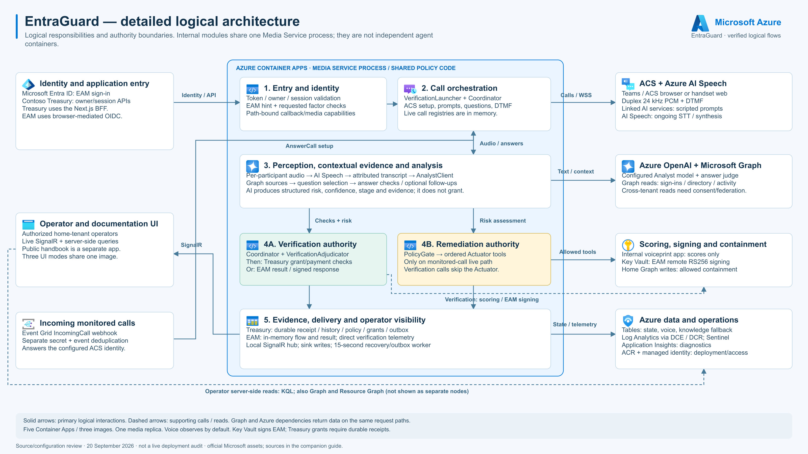

# EntraGuard

**Your MFA proves someone has the phone. It cannot tell you who is standing next to them.**

EntraGuard places the verification call, asks about things only you could know from your own
sign-in activity minutes earlier — and *listens to the room while you answer*. If somebody is
coaching you through it, the verification is refused even though every digit was correct.

It plugs into Microsoft Entra ID as an **External Authentication Method**, so one Conditional
Access policy makes it a second factor for **every application in a tenant** — Microsoft 365,
the Azure portal, gallery SaaS, your own apps — with no change to any of them.

<sub>Microsoft Garage hackathon project. Implementation as reviewed **20 September 2026**. Every
number below is measured on this deployment; the limits are listed as plainly as the features.</sub>

---

## Try it

| | |
|---|---|
| 🏦 **[placeholders.my](https://placeholders.my)** | Contoso Treasury — a customer app that integrated EntraGuard. Sign in with a work account, move money, get called. |
| 🛡️ **[entraguard.my](https://entraguard.my)** | Operator console — live calls, risk trajectories, verification ledger. Home-tenant operators only. |
| 📖 **[docs.entraguard.my](https://docs.entraguard.my)** | The handbook — user manual, decision internals, full API reference. |
| 🔌 **[api.entraguard.my](https://api.entraguard.my/.well-known/openid-configuration)** | The OIDC discovery document Entra reads to use EntraGuard as an MFA method. |

Work or school accounts only — EntraGuard authenticates people against *directory* facts, and a
personal account has no directory behind it.

---

## The attack this exists for

In 2023, attackers walked into MGM Resorts and Caesars by **phoning the help desk**. No malware,
no zero-day. They knew enough about an employee to sound like them, and asked for an MFA reset.
Scattered Spider has repeated it across dozens of organisations since.

Every control in that flow worked exactly as designed:

- Entra ID Protection saw a sign-in. It was normal.
- The MFA prompt was approved. By the real user.
- The help-desk agent followed procedure.

**Entra ID Protection sees the sign-in. It is blind to the phone call that caused it.** That call
is where the compromise actually happens, and nothing in the identity stack is listening to it.

---

## Three things here that are not ordinary MFA

### 1. Questions an attacker could not have researched

Not "your mother's maiden name". EntraGuard reads *your own sign-in activity from the last few
hours* and asks about it — which city you were in, which browser you used, who you last exchanged
Teams messages with, which team you are in.

Nothing is stored, so there is nothing to breach. The answers expire by themselves. And an
attacker who phoned you twenty minutes ago could not have prepared: **the question did not exist
until the call started.**

### 2. It listens for coercion while you answer

Number matching proves the person holding the phone is the person at the browser. It cannot prove
you are acting *freely* — somebody standing over you saying "press four seven" satisfies it
perfectly.

So every three seconds, an Analyst scores the live transcript. Because the audio is **unmixed**,
a second voice on your own line is visible as a second voice. Measured on a real coercion test on
this deployment, with a "help desk" reading answers aloud:

```
17:02:54   risk=5    Unaware
17:03:17   risk=45   Engaged          ← "just say Kuala Lumpur, that's what it wants"
17:04:01   risk=85   AboutToApprove
```

The model never acts. It produces a `RiskAssessment`; a pure, exhaustively tested policy gate
decides what is permitted. **Autonomy lives upstream; authority lives in `PolicyGate.cs`.**

### 3. It is a real Entra authentication method, not an app integration

Contoso Treasury shows what an app gets when it integrates deliberately. The External
Authentication Method is the other half — OIDC, the slot Microsoft built for third-party MFA:

| | SAML IdP proxy | External Authentication Method |
|---|---|---|
| Apps to change | every one | **none** |
| In the sign-in path | always | only when a policy asks for a second factor |
| If it is down | nobody signs in | the policy fails; first factor untouched |
| Configuration | per application | one Conditional Access policy, tenant-wide |

---

## The honesty that cost us a feature

Microsoft's `amr` vocabulary contains `vbm` — *"biometric with voiceprint"*. It describes this
product almost too well, and **we do not send it.**

Voice runs in observe mode. It is scored, recorded and shown, and it cannot refuse anybody — the
same enrolled speaker scored **0.278** on one call and **0.7401** on another. Sending `vbm` would
tell Entra a biometric factor was verified, and Entra would grant MFA on the strength of it, while
nothing about the voice can fail a sign-in.

So EntraGuard claims `tel` — confirmation by telephone, therefore *possession* — which is what
ringing an enrolled endpoint and demanding a number match actually proves. One consequence:
if your **first** factor was already possession-based (a passkey), Entra asks for inherence, a
phone call cannot supply it, and EntraGuard **declines before ringing anybody** rather than
interrupting you for a result that could never be accepted.

`EamClaims.cs` is pure and exhaustively tested for exactly this reason: the claim is the security
decision.

---

## Architecture

[](docs/diagrams/flows/00-logical-architecture.svg)

<sub>Click for the SVG. Nine step-by-step flow diagrams with accompanying notes are in the
[flow pack](docs/architecture-flows.md).</sub>

| Flow | What it traces |
|---|---|
| [00 Logical architecture](docs/diagrams/flows/00-logical-architecture.svg) | Every component and the paths between them |
| [01 Sign-in and device registration](docs/diagrams/flows/01-treasury-session-device.svg) | Entra token → revocable server session → registered endpoint |
| [02 External Authentication Method](docs/diagrams/flows/02-entra-external-authentication.svg) | The EAM handshake, hint validation and the signed response |
| [03 Verification decision logic](docs/diagrams/flows/03-shared-verification-decisions.svg) | Number match, question selection, coercion checks, adjudication |
| [04 Verification and session grant](docs/diagrams/flows/04-treasury-verification-grant.svg) | How a passed call becomes access, and for how long |
| [05 Transaction-bound approval](docs/diagrams/flows/05-transaction-bound-payment.svg) | Binding a verification to immutable payment details |
| [06 Monitored-call response](docs/diagrams/flows/06-monitored-call-response.svg) | Interception, scoring and the policy gate's ordered actions |
| [07 Voice enrolment](docs/diagrams/flows/07-voice-enrollment.svg) | Consent, three phrases, encrypted templates, deletion |
| [08 Evidence and telemetry](docs/diagrams/flows/08-persistence-observability.svg) | Durable receipts, outbox, Log Analytics and Sentinel |

## How a verification runs

```
Any app  →  Entra sign-in  →  Conditional Access: second factor required
                                        │
                              EntraGuard /api/eam/authorize
                              (id_token_hint, signed by Microsoft, deliberately expired)
                                        │
                          ACS places a call — Teams, browser softphone or handset
                                        │
                    ┌───────────────────┴────────────────────┐
                    │  Number match          Questions from  │
                    │  (2 digits, on a       live sign-in    │
                    │   screen only you      activity        │
                    │   can see)                             │
                    └───────────────────┬────────────────────┘
                                        │
              unmixed audio ──→ Speech ──→ Analyst (every 3s) ──→ PolicyGate
                                        │
                            Deterministic verdict + assurance
                                        │
                      id_token { acr, amr:["tel"] }  →  MFA satisfied
                      error=access_denied            →  sign-in refused
```

---

## See it work in three minutes, without a phone

Every simulation runs the **real** Analyst, the real policy gate, the real Actuator and the real
Sentinel writes. Only ACS and Speech are bypassed, because the transcript is supplied rather than
recognised. Sessions started this way are labelled **Simulated** everywhere they appear.

```bash
export MEDIA="https://api.entraguard.my"

# The attack: help-desk impersonation, coached MFA approval
curl -s -X POST "$MEDIA/api/simulate" -H 'Content-Type: application/json' \
  -d '{"scenario":"helpdesk-fraud","subjectUpn":"demo.user@contoso.com","paceMs":900}'

# The control that matters more. Same surface features — a help desk, a password
# reset, urgency — and it MUST stay under 40. A detector you only ever watch fire
# is a detector you cannot evaluate.
curl -s -X POST "$MEDIA/api/simulate" -H 'Content-Type: application/json' \
  -d '{"scenario":"benign-helpdesk","paceMs":900}'
```

Open **Live calls** in the console first and watch the risk trajectory, gate decisions and
executed actions stream over SignalR as the replay runs. These endpoints require an operator
session — see the [handbook](https://docs.entraguard.my).

---

## What we measured on this deployment

| | |
|---|---|
| Call duration, 23 real calls | median **108s**, worst **156s** (Entra abandons a sign-in at ~300s) |
| Coercion test | risk climbed **5 → 85** as a scripted "help desk" fed answers |
| Voice, same enrolled speaker | **0.278** and **0.7401** on different calls — why it cannot gate anything yet |
| Unit tests | **426**, covering the policy gate, question selection, assurance and EAM claim mapping |
| Analyst latency | 5.6–9.9s, mean 6.9s on `gpt-5-mini` (earlier replays; not a current benchmark) |

---

## Current capabilities

| Capability | Implementation and limits |
|---|---|
| Work-account sign-in | Entra API tokens establish revocable server sessions; owner identity derives from validated tenant/object claims on every channel |
| Verification channels | Teams, browser ACS softphone, or a handset web page connected through QR enrollment; no PSTN number is provisioned in the documented demo |
| Number matching | Two random digits, three attempts; ACS recognition, media-stream DTMF and browser-device submission paths |
| Identity questions | Sign-in telemetry plus directory/profile and recent calendar, mail, chat and file activity where permissions/data permit; includes manager/direct-report questions |
| Question selection | Up to four questions total, including a registered rider when available; actual asked/correct source provenance is recorded |
| Coercion detection | The Analyst evaluates the conversation, including coaching on the protected user's own audio channel. The coordinator checks coercion while waiting for answers and at final adjudication |
| Adaptive conversation | Deterministic follow-up budgets, question retries and warm/protective register; optional realtime voice agent constrained to supplied speech |
| Voice biometrics | SpeechBrain ECAPA-TDNN, consented three-phrase enrollment, encrypted 192-dimensional templates, re-enrollment and deletion |
| Assurance | Source-aware `None/Low/Substantial/High`, with server-enforced tenant minimum, age, channels and optional Analyst requirement; not certified AAL levels |
| Readiness and diagnostics | Pre-call readiness, telemetry/profile probes, media evidence and actionable fault records |
| Remediation | Spoken warnings, session revocation, quarantine membership, P2 risk elevation where available, Sentinel incidents and conditional call termination |
| Simulations | Separate intercepted-call replay and verification-adjudication simulation; see [demo runbook](docs/demo-runbook.md) for what each actually exercises |

Profile sources are implemented. Directory facts remain researchable and alone cannot raise assurance above Low. Readiness examines the full source pool without returning expected answers; actual correctly answered sign-in evidence is required for High assurance. See [architecture](docs/architecture.md).

## The three web experiences

All three are built from **`src/portal/`**, using Next.js 15, React 19 and Node.js 22+. `APP_MODE` selects which product an instance is, so there is one image and one pipeline rather than three component trees to drift apart.

### Contoso Treasury — the relying party

`APP_MODE=treasury` gives Treasury its own hostname; middleware routes `/` to `/app` and excludes operator pages.

- Redesigned Microsoft sign-in and guided verification journey.
- Signed-in overview with illustrative portfolio totals and composition.
- Searchable, status-filtered and sortable payment runs, detail dialogs and CSV export.
- Session security page displaying the verification result, reported assurance, voice outcome and detected risk.
- Settings for identity, voice recognition, durable history, saved preferences/devices/inbox, and tenant policy/readiness.
- Responsive layouts, keyboard-operable controls and reduced-motion support.

**Financial records remain demo data.** A protected server sample ledger is enabled with `TREASURY_DEMO_LEDGER=true`. Approver-role users can persist idempotent approvals after transaction-bound verification. There is no bank execution or funds movement. Access resumes across reloads only while the server session, receipt and current policy permit it.

### EntraGuard operator console

Overview `/`, live calls `/live`, verification ledger `/verification`, and resource footprint `/health` require an authorized home-tenant operator through `/operator-signin`. Diagnostics, simulation and SignalR access are operator-restricted. Standalone `/sentinel` and `/identity` frontend pages are obsolete.

### EntraGuard handbook

`APP_MODE=docs` serves a single self-contained page — user manual, decision internals, API
reference and operations runbook — and rewrites every other route to it, so the operator
console is not reachable on that hostname. Hostnames in the page are substituted at request
time from the bound custom domains rather than baked in, and it scales to zero, so the first
request after an idle period is slow.

## Azure infrastructure

Five Container Apps, three images — the portal image serves three products, selected by `APP_MODE`:

| Container App | Responsibility | Ingress | Bicep CPU / memory / replicas |
|---|---|---|---|
| `ca-entraguard-media` | .NET 9 call processing, verification, detection and remediation | Public :8080 | 1 / 2 GiB / **1** |
| `ca-entraguard-portal` | Operator console | Public :3000 | 0.5 / 1 GiB / 1–2 |
| `ca-contoso-treasury` | Treasury, using the same portal image | Public :3000 | 0.5 / 1 GiB / 1–2 |
| `ca-entraguard-docs` | The handbook, same image again | Public :3000 | 0.25 / 0.5 GiB / **0**–2 |
| `ca-entraguard-voiceprint` | Python/FastAPI speaker scoring | Internal :8000 | 2 / 4 GiB / 1–2 |

The voiceprint “sidecar” is a **separate Container App**. Main deployment: `rg-entraguard-demo`, `eastus`, environment `cae-entraguard-demo`. Supporting services include ACS, Event Grid, AI Speech, AI Services, Azure OpenAI, ACR, Storage, Key Vault (the External Authentication Method signing certificate, non-exportable and used through the managed identity), a user-assigned managed identity, Log Analytics, Sentinel, DCE/DCR and Application Insights. **Sixteen Azure resource types, no secrets in the identity path** — every Azure dependency authenticates with the managed identity.

See [deployment and resource inventory](docs/deployment.md) for names, configuration and setup coverage.

## Decision boundaries and operating modes

The Analyst returns evidence; [`PolicyGate`](src/EntraGuard.Shared/Policy/PolicyGate.cs) decides remediation. Effective risk includes compliance-stage urgency:

- **40:** SOC notification.
- **60:** spoken warning.
- **80:** incident and identity containment proposals.
- **90 + `AboutToApprove`:** termination may be authorized.
- Disruptive actions require analyst confidence **≥0.75**, and identity actions require a resolved subject.

[`VerificationAdjudicator`](src/EntraGuard.MediaService/Endpoints/VerificationAdjudicator.cs) separately refuses detected coercion at risk **≥60** and confidence **≥0.75**, even with correct digits.

| Configuration | Effect |
|---|---|
| `ENTRAGUARD_RISK_TIER=degraded` | Substitutes quarantine membership for unavailable P2 risk elevation. Group membership needs a configured Conditional Access policy to affect access |
| `ENTRAGUARD_SHADOW_MODE=true` | Suppresses identity/call remediation, **but telemetry, SOC notifications and warranted Sentinel incidents remain allowed**. Not a universal dry-run switch for verification |
| `VOICE_MODE=observe` | Default deployment behavior: records scores without voice-driven enforcement |
| `VOICE_MODE=enforce` | A weak match yields `StepUpRequired`; a fresh same-owner MFA event must be validated server-side before a grant. Legacy `BlockedVoiceMismatch` remains non-authorizing |
| `VOICE_AGENT=on` | Deployment-script opt-in for the realtime agent. Otherwise scripted speech is used |

Session revocation is not a guarantee of instantaneous invalidation of every existing access token. Graph permissions, licensing, Conditional Access setup and successful telemetry ingestion all matter; a supported action is not guaranteed to succeed.

## Data and current maturity

- `EntraGuardState` persists sessions, owner-scoped devices/presence, receipts/history, policies, preferences, notifications and optional demo approvals using conditional tenant-partition transactions.
- Live call handles remain process-local; media is pinned to one replica. Interrupted calls fail by deadline rather than resume after restart.
- Verification completion atomically creates telemetry outbox work; delivery is retried and is at least once.
- Existing knowledge/voice stores remain. The old `Sessions` table and `transcripts` Blob container are not the new ledger; full transcript archival remains unimplemented.
- Log Analytics receives verdicts, evidence and **transcript excerpts up to 4,000 characters**, plus remediation, verification, biometric lifecycle and fault records. Raw voice-enrollment audio is processed in memory.
- Registered answers are currently retained in **readable form as well as hashes** for spoken-answer matching. The older “hash-only” claim is incorrect.
- Azure service access primarily uses managed identity. `VOICEPRINT_KEY` is still application encryption key material; this is not an entirely secret-free deployment.
- Owner APIs require validated credentials; ledger reads/approvals additionally require grants and roles. ACS callback/media URLs use expiring path-bound capabilities, Event Grid has a separate webhook secret, and session-cookie mutations require the configured same origin.
- No PAD/voice-clone detection is implemented. Synthetic-voice calibration is not real-telephony accuracy validation.

This is a substantial MVP, not a production-complete authentication service. See [threat model](docs/standards-and-threat-model.md) and the prioritized [backend roadmap](docs/backend-roadmap.md).

## Development and verification

Use the .NET 9 SDK selected by `global.json`:

```bash
dotnet test EntraGuard.sln
```

In **`src/portal/`**:

```bash
npm ci
npm run dev
npm run build
```

Supply runtime variables from [`.env.example`](.env.example). ASP.NET Core does not automatically load a root `.env` file: export the variables in the service process or use your local configuration tooling. Next.js development can use an uncommitted `src/portal/.env.local`. There is no committed frontend test suite or `npm test` script; a production build checks compilation/types, not end-to-end calls.

Real call testing needs a publicly reachable HTTPS/WSS media callback host, correct Entra redirect URIs, consent and a registered calling endpoint. Local visual previews alone do not prove sign-in or telephony.

## Deployment

The repository's full-deployment sequence is:

```bash
./scripts/00-preflight.sh
./scripts/01-deploy-infra.sh
./scripts/02-entra-apps.sh
./scripts/deploy-apps.sh
./scripts/04-eventgrid-subscribe.sh
./scripts/smoke-test.sh
```

Optional, and independent of each other:

```bash
./scripts/08-external-auth-method.sh   # register EntraGuard as a second factor for any app
./scripts/09-custom-domains.sh         # bind custom hostnames and their redirect URIs
```

These scripts modify cloud resources. `deploy-apps.sh` updates media, portal **and** Treasury; it is not a Treasury-only command. Sessions, callback secrets and authenticated clients require coordinated rollout: follow [security-migration.md](docs/security-migration.md). Voiceprint image builds require `VOICEPRINT=rebuild`. Additional Entra/Teams/federation setup and live validation remain necessary.

## Repository map

| Path | Purpose |
|---|---|
| [`src/EntraGuard.MediaService/`](src/EntraGuard.MediaService) | ASP.NET Core backend |
| [`src/EntraGuard.Shared/`](src/EntraGuard.Shared) | Domain models and deterministic policy/verification/voice rules |
| [`src/portal/`](src/portal) | Azure-deployed operator console, Treasury and handbook — one image, selected by `APP_MODE` |
| [`src/voiceprint/`](src/voiceprint) | SpeechBrain scoring service |
| [`infra/`](infra) | Bicep infrastructure |
| [`scripts/`](scripts) | Deployment, federation, calibration and smoke tests |
| [`tests/`](tests) | xUnit backend tests |
| [`docs/`](docs) | Architecture, deployment, demo, threat model and roadmap |

The separate top-level `portal/` is a vinext/Cloudflare-oriented project and is **not** the frontend built by the Azure deployment script. `docs/plans/` and `docs/blog/` contain historical design/publication artifacts; use the current docs above for implementation status.

---

## What this does not do

Written plainly, because a security tool that overstates itself is the thing it is supposed to
prevent.

- **It is not a certified assurance level.** The `None/Low/Substantial/High` scale is EntraGuard's
  own, deliberately not labelled AAL or eIDAS. Borrowing those names would claim a conformance
  nobody has assessed.
- **Voice cannot refuse anybody.** `VOICE_MODE=observe`, and it stays there until a genuine
  speaker reliably lands in the genuine band. See the honesty section above.
- **No presentation-attack detection.** Nothing here detects a voice clone. Synthetic-voice
  calibration is not real-telephony accuracy validation.
- **A pass is not proof coercion was absent.** It is proof none was *detected*, at a stated
  confidence.
- **Reach is not coverage.** The method is available to every application in a consenting tenant,
  but EntraGuard still has to *phone the user* — which needs that tenant to allow-list the
  Communication Services resource separately.
- **State is in-process.** Verification records live in memory with five-minute retention; a
  replica restart loses them. Durable history is implemented for receipts, not for live calls.
- **Registered answers are readable.** The stored security question keeps a cleartext answer so
  the judge can accept "St Mary's" for "Saint Mary's". The UI says so and tells users not to
  reuse a password.

The [threat model](docs/standards-and-threat-model.md) lists what each signal contributes **and
what it does not prove**, signal by signal.

---

## What building it taught us

**Degradation is invisible by construction.** The most expensive bug in this project was a
`SPEECH_LANGUAGE` of `en-MY` — a reasonable-looking locale that Azure Speech does not have. The
recogniser was rejected at connect, every spoken answer became "nothing heard", and three
consecutive real callers were refused for questions they had answered correctly out loud. Nothing
in the verdict, the record or the portal said recognition had died. That is why this codebase has
a `Fault` type that will not let you record a failure without naming what the *user* experienced,
the probable cause, and the next action.

**Causes that need opposite fixes must never look identical.** "Not consented" and "no mailbox"
are both a missing question. "Never ran" and "scored zero" are both a zero. "The call carried no
audio" and "the call ended" are both silence. Each pair is now distinguishable in the record,
because each pair has a different fix.

**The model must not be the authority.** A language model reading a live conversation and
proposing remediation is the interesting part and the dangerous part. It proposes; `PolicyGate.cs`
decides; every refused action is recorded alongside the ones taken.

**Claiming a factor you do not enforce is the one unforgivable lie.** It would have been one
string to send `vbm` and inherit an inherence factor we have not earned.

---

## Documentation

| | |
|---|---|
| [**Handbook**](https://docs.entraguard.my) | User manual, decision internals, full API reference, KQL cookbook, runbook |
| [Architecture](docs/architecture.md) | Runtime boundaries and how the pieces fit |
| [**Flow diagrams**](docs/architecture-flows.md) | Nine step-by-step flows, SVG and PNG, with notes |
| [Hackathon architecture](docs/hackathon-architecture.md) | The single-diagram overview and what it shows |
| [Admin console](docs/admin-console.md) | What each operator blade does |
| [External authentication method](docs/external-auth-method.md) | Making EntraGuard a factor for any app |
| [Threat model](docs/standards-and-threat-model.md) | What each signal proves, and what it does not |
| [Deployment inventory](docs/deployment.md) | Resources, hostnames, configuration |
| [Demo runbook](docs/demo-runbook.md) | What each simulation actually exercises |
| [Backend roadmap](docs/backend-roadmap.md) | What is proposed but not implemented |

## Licence

MIT. See [LICENSE](LICENSE).
