# EntraGuard — detailed logical and step-by-step flow diagrams

Verified against repository implementation and deployment configuration on **20 September 2026**. Live Azure settings/health were not audited.

## Open the diagram pack

[Browsable gallery](diagrams/flows/index.html) · All nine diagrams are **3200 × 1800 (16:9)** PNGs with self-contained SVG versions and official Microsoft assets.

| Diagram | PNG | SVG |
|---|---|---|
| 00 — EntraGuard — detailed logical architecture | [PNG](diagrams/flows/00-logical-architecture.png) | [SVG](diagrams/flows/00-logical-architecture.svg) |
| 01 — Treasury sign-in and device registration | [PNG](diagrams/flows/01-treasury-session-device.png) | [SVG](diagrams/flows/01-treasury-session-device.svg) |
| 02 — Entra External Authentication Method — EAM | [PNG](diagrams/flows/02-entra-external-authentication.png) | [SVG](diagrams/flows/02-entra-external-authentication.svg) |
| 03 — Shared verification — step-by-step decision logic | [PNG](diagrams/flows/03-shared-verification-decisions.png) | [SVG](diagrams/flows/03-shared-verification-decisions.svg) |
| 04 — Treasury verification, step-up and session grant | [PNG](diagrams/flows/04-treasury-verification-grant.png) | [SVG](diagrams/flows/04-treasury-verification-grant.svg) |
| 05 — Transaction-bound Treasury payment approval | [PNG](diagrams/flows/05-transaction-bound-payment.png) | [SVG](diagrams/flows/05-transaction-bound-payment.svg) |
| 06 — Incoming monitored-call analysis and response | [PNG](diagrams/flows/06-monitored-call-response.png) | [SVG](diagrams/flows/06-monitored-call-response.svg) |
| 07 — Voice enrollment, consent and template storage | [PNG](diagrams/flows/07-voice-enrollment.png) | [SVG](diagrams/flows/07-voice-enrollment.svg) |
| 08 — Durable evidence, telemetry and recovery | [PNG](diagrams/flows/08-persistence-observability.png) | [SVG](diagrams/flows/08-persistence-observability.svg) |

## How to read the pack

- Start with **00** for logical responsibilities and **03** for actual verification decisions.
- **01** establishes the Treasury session. **04** starts verification, calls the shared logic in **03**, then performs the separate grant checks. **05** adds a payment-bound attempt.
- **02 → 03 → 02** covers EAM: it shares the call engine but has its own outcome/signing lifecycle.
- **06** covers incoming monitored calls; **07** is enrollment; **08** explains durability and monitoring.
- Sequence diagrams read from top to bottom. Dashed arrows are responses or conditional interactions; conditional steps are not mandatory stages. Audio, polling and background analysis can overlap.
- A line crossing is not a junction. Grouped endpoints are logical participants, not extra deployed containers. BFF means Next.js backend-for-frontend.

## 00 — EntraGuard — detailed logical architecture

Logical responsibilities and authority boundaries. Internal modules share one Media Service process; they are not independent agent containers.


| Logical block | Implementation behavior |
|---|---|
| Identity and application entry | Microsoft Entra ID: EAM sign-in Contoso Treasury: owner/session APIs Treasury uses the Next.js BFF. EAM uses browser-mediated OIDC. |
| Operator and documentation UI | Authorized home-tenant operators Live SignalR + server-side queries Public handbook is a separate app. Three UI modes share one image. |
| Incoming monitored calls | Event Grid IncomingCall webhook Separate secret + event deduplication Answers the configured ACS identity. |
| 1. Entry and identity | Token / owner / session validation EAM hint + requested factor checks Path-bound callback/media capabilities |
| 2. Call orchestration | VerificationLauncher + Coordinator ACS setup, prompts, questions, DTMF Live call registries are in memory. |
| 3. Perception, contextual evidence and analysis | Per-participant audio → AI Speech → attributed transcript → AnalystClient Graph sources → question selection → answer checks / optional follow-ups AI produces structured risk, confidence, stage and evidence; it does not grant. |
| 4A. Verification authority | Coordinator + VerificationAdjudicator Then: Treasury grant/payment checks Or: EAM result / signed response |
| 4B. Remediation authority | PolicyGate → ordered Actuator tools Only on monitored-call live path Verification calls skip the Actuator. |
| 5. Evidence, delivery and operator visibility | Treasury: durable receipt / history / policy / grants / outbox EAM: in-memory flow and result; direct verification telemetry Local SignalR hub; sink writes; 15-second recovery/outbox worker |
| ACS + Azure AI Speech | Teams / ACS browser or handset web Duplex 24 kHz PCM + DTMF Linked AI services: scripted prompts AI Speech: ongoing STT / synthesis |
| Azure OpenAI + Microsoft Graph | Configured Analyst model + answer judge Graph reads: sign-ins / directory / activity Cross-tenant reads need consent/federation. |
| Scoring, signing and containment | Internal voiceprint app: scores only Key Vault: EAM remote RS256 signing Home Graph writes: allowed containment |
| Azure data and operations | Tables: state, voice, knowledge fallback Log Analytics via DCE / DCR; Sentinel Application Insights: diagnostics ACR + managed identity: deployment/access |

- Solid arrows: primary logical interactions. Dashed arrows: supporting calls / reads. Graph and Azure dependencies return data on the same request paths.
- Five Container Apps / three images. One media replica. Voice observes by default. Key Vault signs EAM; Treasury grants require durable receipts.

<details>
<summary>Editable Mermaid view</summary>

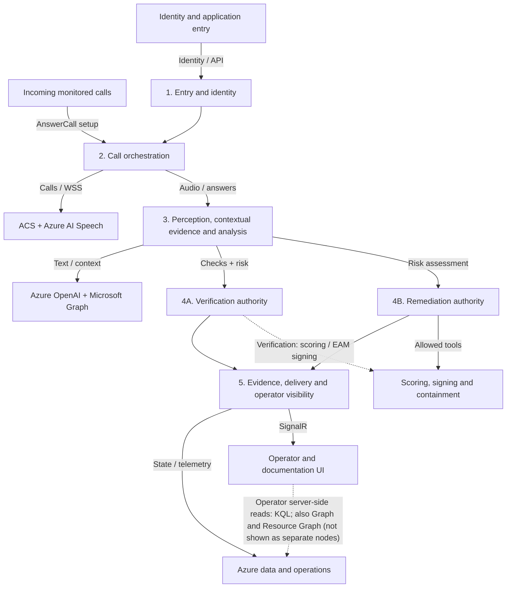

</details>

**Source evidence:**

- [`infra/modules/compute.bicep`](../infra/modules/compute.bicep)
- [`src/EntraGuard.MediaService/Program.cs`](../src/EntraGuard.MediaService/Program.cs)
- [`src/EntraGuard.MediaService/Auth/ApiAccessMiddleware.cs`](../src/EntraGuard.MediaService/Auth/ApiAccessMiddleware.cs)
- [`src/EntraGuard.MediaService/Endpoints/MediaSocketEndpoint.cs`](../src/EntraGuard.MediaService/Endpoints/MediaSocketEndpoint.cs)
- [`src/EntraGuard.MediaService/Sessions/VerificationCoordinator.cs`](../src/EntraGuard.MediaService/Sessions/VerificationCoordinator.cs)
- [`src/EntraGuard.MediaService/Sessions/GrantService.cs`](../src/EntraGuard.MediaService/Sessions/GrantService.cs)
- [`src/EntraGuard.MediaService/Tools/CrossTenantGraph.cs`](../src/EntraGuard.MediaService/Tools/CrossTenantGraph.cs)

## 01 — Treasury sign-in and device registration

Establish a revocable server session, then make an ACS web endpoint reachable. Sign-in alone does not verify a session.

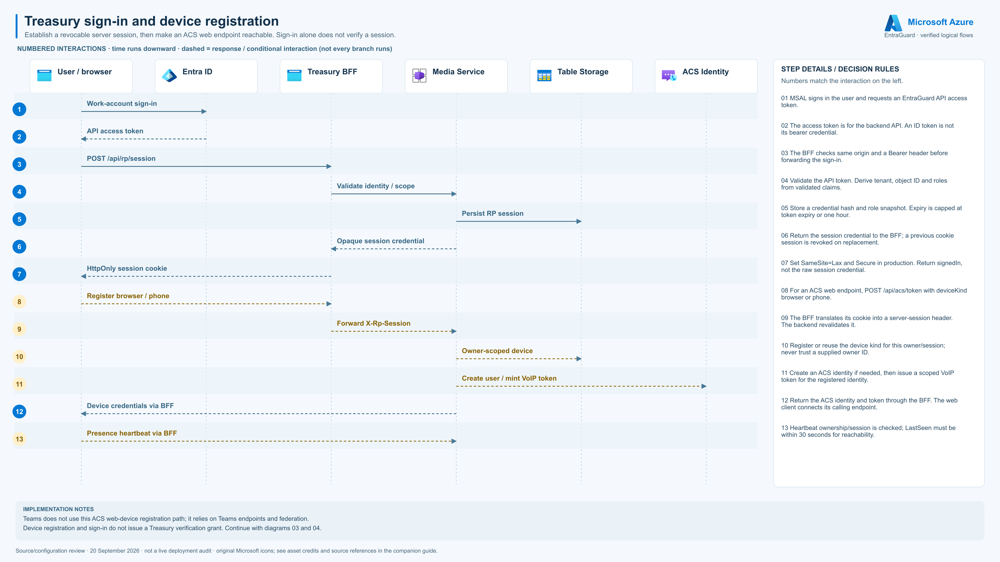

| Step | Interaction | Checks / outcomes |
|---|---|---|
| 1 | Work-account sign-in | MSAL signs in the user and requests an EntraGuard API access token. |
| 2 | API access token | The access token is for the backend API. An ID token is not its bearer credential. |
| 3 | POST /api/rp/session | The BFF checks same origin and a Bearer header before forwarding the sign-in. |
| 4 | Validate identity / scope | Validate the API token. Derive tenant, object ID and roles from validated claims. |
| 5 | Persist RP session | Store a credential hash and role snapshot. Expiry is capped at token expiry or one hour. |
| 6 | Opaque session credential | Return the session credential to the BFF; a previous cookie session is revoked on replacement. |
| 7 | HttpOnly session cookie | Set SameSite=Lax and Secure in production. Return signedIn, not the raw session credential. |
| 8 | Register browser / phone *(conditional)* | For an ACS web endpoint, POST /api/acs/token with deviceKind browser or phone. |
| 9 | Forward X-Rp-Session *(conditional)* | The BFF translates its cookie into a server-session header. The backend revalidates it. |
| 10 | Owner-scoped device *(conditional)* | Register or reuse the device kind for this owner/session; never trust a supplied owner ID. |
| 11 | Create user / mint VoIP token *(conditional)* | Create an ACS identity if needed, then issue a scoped VoIP token for the registered identity. |
| 12 | Device credentials via BFF | Return the ACS identity and token through the BFF. The web client connects its calling endpoint. |
| 13 | Presence heartbeat via BFF *(conditional)* | Heartbeat ownership/session is checked; LastSeen must be within 30 seconds for reachability. |

- Teams does not use this ACS web-device registration path; it relies on Teams endpoints and federation.
- Device registration and sign-in do not issue a Treasury verification grant. Continue with diagrams 03 and 04.

<details>
<summary>Editable Mermaid view</summary>

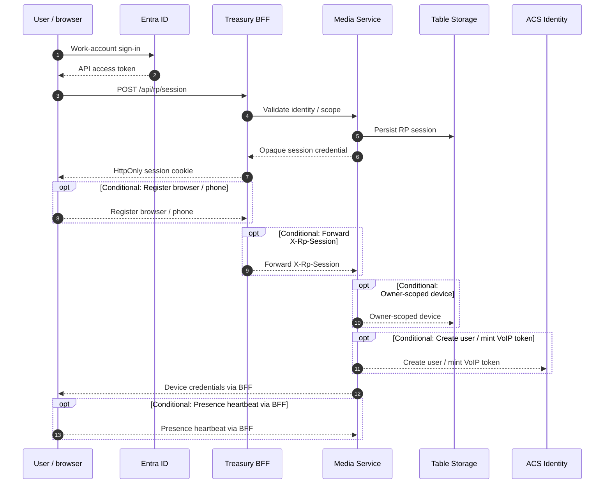

</details>

**Source evidence:**

- [`src/portal/app/api/rp/session/route.ts`](../src/portal/app/api/rp/session/route.ts)
- [`src/portal/lib/rpProxy.ts`](../src/portal/lib/rpProxy.ts)
- [`src/EntraGuard.MediaService/Auth/RpSessionService.cs`](../src/EntraGuard.MediaService/Auth/RpSessionService.cs)
- [`src/EntraGuard.MediaService/Auth/VoiceProfileAuth.cs`](../src/EntraGuard.MediaService/Auth/VoiceProfileAuth.cs)
- [`src/EntraGuard.MediaService/Endpoints/AcsIdentityEndpoint.cs`](../src/EntraGuard.MediaService/Endpoints/AcsIdentityEndpoint.cs)
- [`src/EntraGuard.MediaService/Sessions/DeviceService.cs`](../src/EntraGuard.MediaService/Sessions/DeviceService.cs)
- [`src/EntraGuard.MediaService/Endpoints/PresenceEndpoint.cs`](../src/EntraGuard.MediaService/Endpoints/PresenceEndpoint.cs)

## 02 — Entra External Authentication Method — EAM

Policy-driven sign-in flow. Browser-mediated OIDC is distinct from Treasury grants and currently targets Teams.

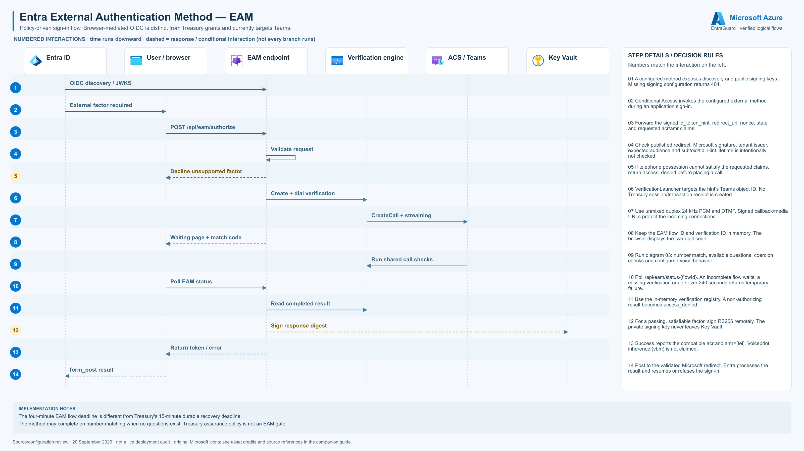

| Step | Interaction | Checks / outcomes |
|---|---|---|
| 1 | OIDC discovery / JWKS | A configured method exposes discovery and public signing keys. Missing signing configuration returns 404. |
| 2 | External factor required | Conditional Access invokes the configured external method during an application sign-in. |
| 3 | POST /api/eam/authorize | Forward the signed id_token_hint, redirect_uri, nonce, state and requested acr/amr claims. |
| 4 | Validate request | Check published redirect, Microsoft signature, tenant issuer, expected audience and sub/oid/tid. Hint lifetime is intentionally not checked. |
| 5 | Decline unsupported factor *(conditional)* | If telephone possession cannot satisfy the requested claims, return access_denied before placing a call. |
| 6 | Create + dial verification | VerificationLauncher targets the hint's Teams object ID. No Treasury session/transaction receipt is created. |
| 7 | CreateCall + streaming | Use unmixed duplex 24 kHz PCM and DTMF. Signed callback/media URLs protect the incoming connections. |
| 8 | Waiting page + match code | Keep the EAM flow ID and verification ID in memory. The browser displays the two-digit code. |
| 9 | Run shared call checks | Run diagram 03: number match, available questions, coercion checks and configured voice behavior. |
| 10 | Poll EAM status | Poll /api/eam/status/{flowId}. An incomplete flow waits; a missing verification or age over 240 seconds returns temporary failure. |
| 11 | Read completed result | Use the in-memory verification registry. A non-authorizing result becomes access_denied. |
| 12 | Sign response digest *(conditional)* | For a passing, satisfiable factor, sign RS256 remotely. The private signing key never leaves Key Vault. |
| 13 | Return token / error | Success reports the compatible acr and amr=[tel]. Voiceprint inherence (vbm) is not claimed. |
| 14 | form_post result | Post to the validated Microsoft redirect. Entra processes the result and resumes or refuses the sign-in. |

- The four-minute EAM flow deadline is different from Treasury's 15-minute durable recovery deadline.
- The method may complete on number matching when no questions exist. Treasury assurance policy is not an EAM gate.

<details>
<summary>Editable Mermaid view</summary>

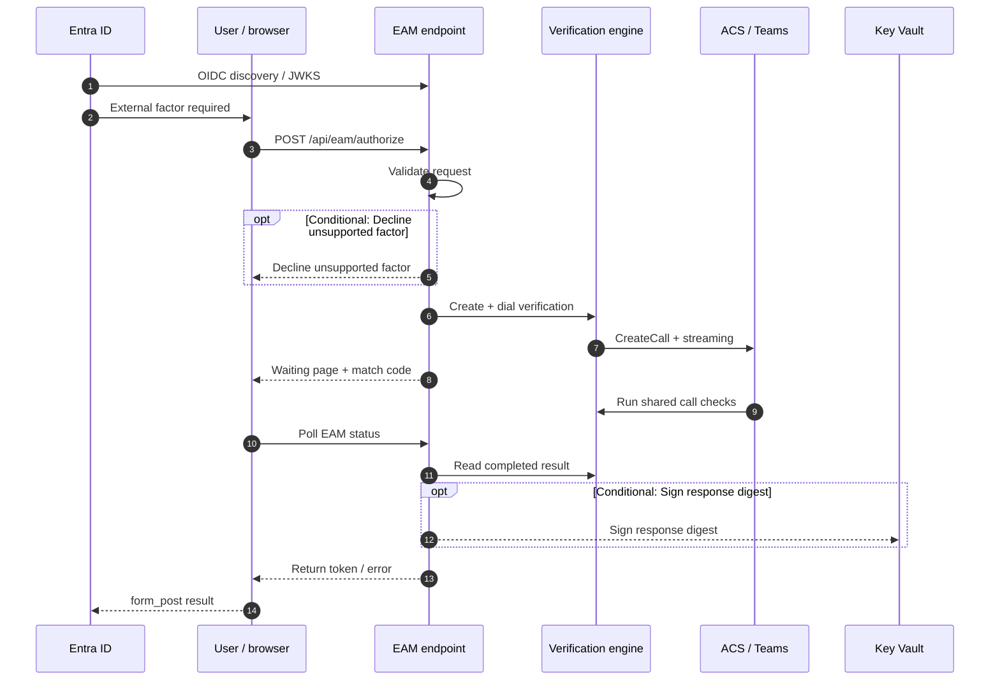

</details>

**Source evidence:**

- [`src/EntraGuard.MediaService/Endpoints/ExternalAuthMethodEndpoint.cs`](../src/EntraGuard.MediaService/Endpoints/ExternalAuthMethodEndpoint.cs)
- [`src/EntraGuard.MediaService/Auth/EamHintValidator.cs`](../src/EntraGuard.MediaService/Auth/EamHintValidator.cs)
- [`src/EntraGuard.MediaService/Auth/EamSigningKeys.cs`](../src/EntraGuard.MediaService/Auth/EamSigningKeys.cs)
- [`src/EntraGuard.MediaService/Auth/EamTokenIssuer.cs`](../src/EntraGuard.MediaService/Auth/EamTokenIssuer.cs)
- [`src/EntraGuard.Shared/Verification/EamClaims.cs`](../src/EntraGuard.Shared/Verification/EamClaims.cs)
- [`src/EntraGuard.MediaService/Sessions/VerificationLauncher.cs`](../src/EntraGuard.MediaService/Sessions/VerificationLauncher.cs)

## 03 — Shared verification — step-by-step decision logic

Used by EAM and Treasury. The code separates call outcomes from downstream authorization and records the evidence actually obtained.

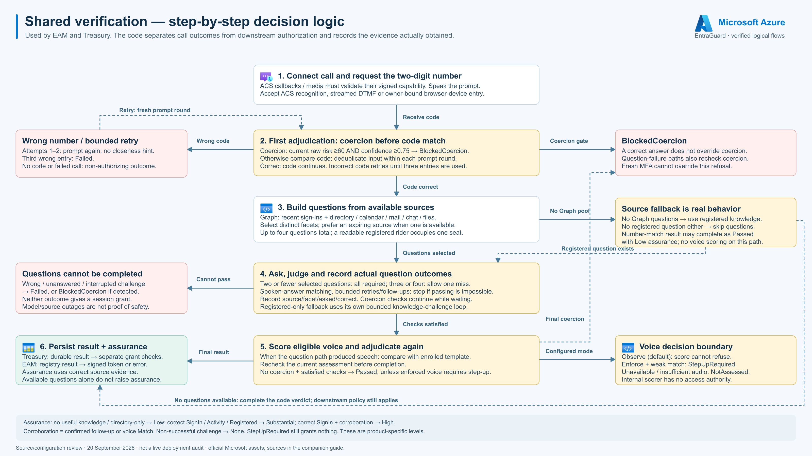

| Logical block | Implementation behavior |
|---|---|
| 1. Connect call and request the two-digit number | ACS callbacks / media must validate their signed capability. Speak the prompt. Accept ACS recognition, streamed DTMF or owner-bound browser-device entry. |
| 2. First adjudication: coercion before code match | Coercion: current raw risk ≥60 AND confidence ≥0.75 → BlockedCoercion. Otherwise compare code; deduplicate input within each prompt round. Correct code continues. Incorrect code retries until three entries are used. |
| Wrong number / bounded retry | Attempts 1–2: prompt again; no closeness hint. Third wrong entry: Failed. No code or failed call: non-authorizing outcome. |
| BlockedCoercion | A correct answer does not override coercion. Question-failure paths also recheck coercion. Fresh MFA cannot override this refusal. |
| 3. Build questions from available sources | Graph: recent sign-ins + directory / calendar / mail / chat / files. Select distinct facets; prefer an expiring source when one is available. Up to four questions total; a readable registered rider occupies one seat. |
| Source fallback is real behavior | No Graph questions → use registered knowledge. No registered question either → skip questions. Number-match result may complete as Passed with Low assurance; no voice scoring on this path. |
| 4. Ask, judge and record actual question outcomes | Two or fewer selected questions: all required; three or four: allow one miss. Spoken-answer matching, bounded retries/follow-ups; stop if passing is impossible. Record source/facet/asked/correct. Coercion checks continue while waiting. Registered-only fallback uses its own bounded knowledge-challenge loop. |
| Questions cannot be completed | Wrong / unanswered / interrupted challenge → Failed, or BlockedCoercion if detected. Neither outcome gives a session grant. Model/source outages are not proof of safety. |
| 5. Score eligible voice and adjudicate again | When the question path produced speech: compare with enrolled template. Recheck the current assessment before completion. No coercion + satisfied checks → Passed, unless enforced voice requires step-up. |
| Voice decision boundary | Observe (default): score cannot refuse. Enforce + weak match: StepUpRequired. Unavailable / insufficient audio: NotAssessed. Internal scorer has no access authority. |
| 6. Persist result + assurance | Treasury: durable result → separate grant checks. EAM: registry result → signed token or error. Assurance uses correct source evidence. Available questions alone do not raise assurance. |

- Assurance: no useful knowledge / directory-only → Low; correct SignIn / Activity / Registered → Substantial; correct SignIn + corroboration → High.
- Corroboration = confirmed follow-up or voice Match. Non-successful challenge → None. StepUpRequired still grants nothing. These are product-specific levels.

<details>
<summary>Editable Mermaid view</summary>

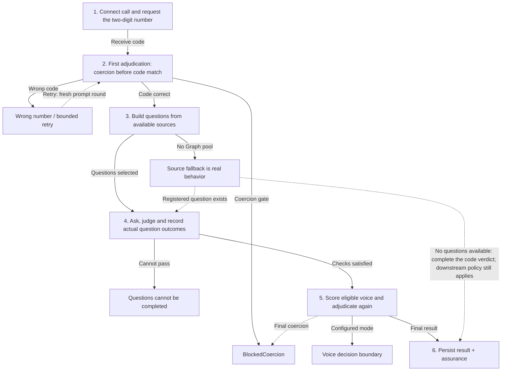

</details>

**Source evidence:**

- [`src/EntraGuard.MediaService/Sessions/VerificationCoordinator.cs`](../src/EntraGuard.MediaService/Sessions/VerificationCoordinator.cs)
- [`src/EntraGuard.MediaService/Endpoints/VerificationAdjudicator.cs`](../src/EntraGuard.MediaService/Endpoints/VerificationAdjudicator.cs)
- [`src/EntraGuard.Shared/Verification/ChallengeSelection.cs`](../src/EntraGuard.Shared/Verification/ChallengeSelection.cs)
- [`src/EntraGuard.Shared/Verification/QuestionEvidence.cs`](../src/EntraGuard.Shared/Verification/QuestionEvidence.cs)
- [`src/EntraGuard.MediaService/Agents/PerceptionAgent.cs`](../src/EntraGuard.MediaService/Agents/PerceptionAgent.cs)
- [`src/EntraGuard.MediaService/Agents/VoiceprintClient.cs`](../src/EntraGuard.MediaService/Agents/VoiceprintClient.cs)

## 04 — Treasury verification, step-up and session grant

A call result is evidence. GrantService performs a separate, owner/session-bound authorization decision.

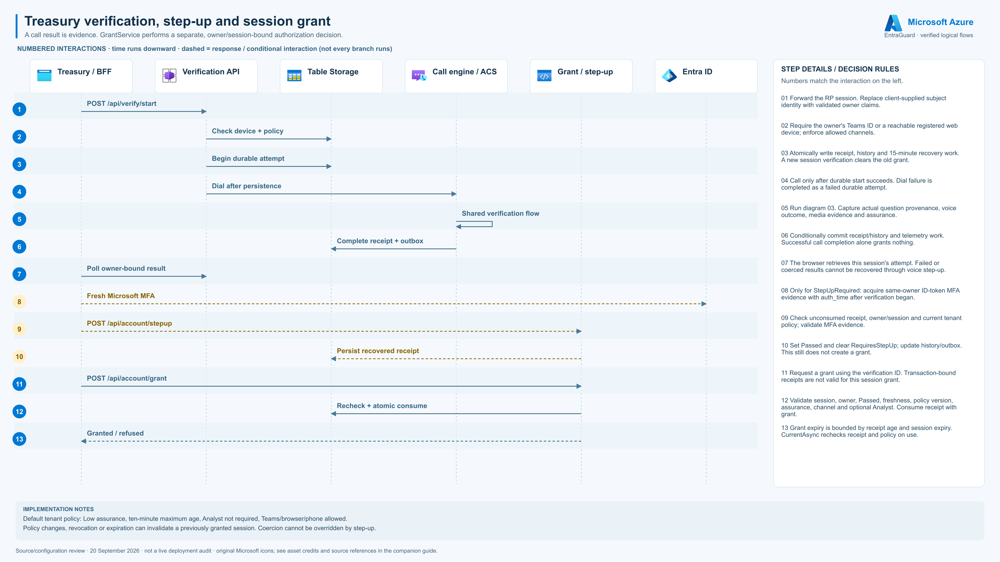

| Step | Interaction | Checks / outcomes |
|---|---|---|
| 1 | POST /api/verify/start | Forward the RP session. Replace client-supplied subject identity with validated owner claims. |
| 2 | Check device + policy | Require the owner's Teams ID or a reachable registered web device; enforce allowed channels. |
| 3 | Begin durable attempt | Atomically write receipt, history and 15-minute recovery work. A new session verification clears the old grant. |
| 4 | Dial after persistence | Call only after durable start succeeds. Dial failure is completed as a failed durable attempt. |
| 5 | Shared verification flow | Run diagram 03. Capture actual question provenance, voice outcome, media evidence and assurance. |
| 6 | Complete receipt + outbox | Conditionally commit receipt/history and telemetry work. Successful call completion alone grants nothing. |
| 7 | Poll owner-bound result | The browser retrieves this session's attempt. Failed or coerced results cannot be recovered through voice step-up. |
| 8 | Fresh Microsoft MFA *(conditional)* | Only for StepUpRequired: acquire same-owner ID-token MFA evidence with auth_time after verification began. |
| 9 | POST /api/account/stepup *(conditional)* | Check unconsumed receipt, owner/session and current tenant policy; validate MFA evidence. |
| 10 | Persist recovered receipt *(conditional)* | Set Passed and clear RequiresStepUp; update history/outbox. This still does not create a grant. |
| 11 | POST /api/account/grant | Request a grant using the verification ID. Transaction-bound receipts are not valid for this session grant. |
| 12 | Recheck + atomic consume | Validate session, owner, Passed, freshness, policy version, assurance, channel and optional Analyst. Consume receipt with grant. |
| 13 | Granted / refused | Grant expiry is bounded by receipt age and session expiry. CurrentAsync rechecks receipt and policy on use. |

- Default tenant policy: Low assurance, ten-minute maximum age, Analyst not required, Teams/browser/phone allowed.
- Policy changes, revocation or expiration can invalidate a previously granted session. Coercion cannot be overridden by step-up.

<details>
<summary>Editable Mermaid view</summary>

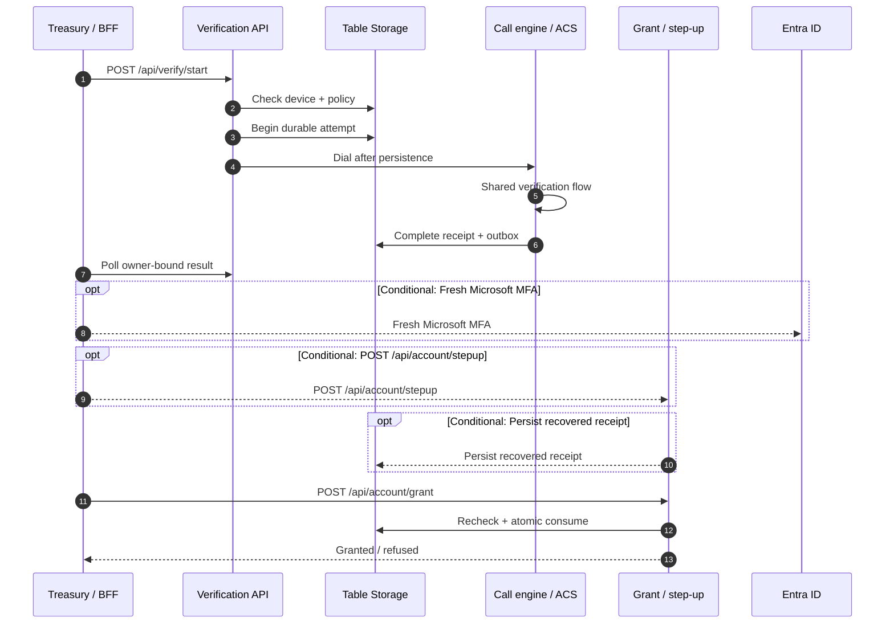

</details>

**Source evidence:**

- [`src/EntraGuard.MediaService/Endpoints/VerificationEndpoint.cs`](../src/EntraGuard.MediaService/Endpoints/VerificationEndpoint.cs)
- [`src/EntraGuard.MediaService/Persistence/VerificationLedger.cs`](../src/EntraGuard.MediaService/Persistence/VerificationLedger.cs)
- [`src/EntraGuard.MediaService/Sessions/GrantService.cs`](../src/EntraGuard.MediaService/Sessions/GrantService.cs)
- [`src/EntraGuard.MediaService/Sessions/StepUpService.cs`](../src/EntraGuard.MediaService/Sessions/StepUpService.cs)
- [`src/EntraGuard.MediaService/Sessions/TenantPolicyService.cs`](../src/EntraGuard.MediaService/Sessions/TenantPolicyService.cs)
- [`src/EntraGuard.MediaService/Auth/MfaEvidence.cs`](../src/EntraGuard.MediaService/Auth/MfaEvidence.cs)
- [`src/EntraGuard.MediaService/Endpoints/AccountEndpoints.cs`](../src/EntraGuard.MediaService/Endpoints/AccountEndpoints.cs)

## 05 — Transaction-bound Treasury payment approval

A separate verification binds approval to a particular payment digest. This is a demo ledger, not bank execution.

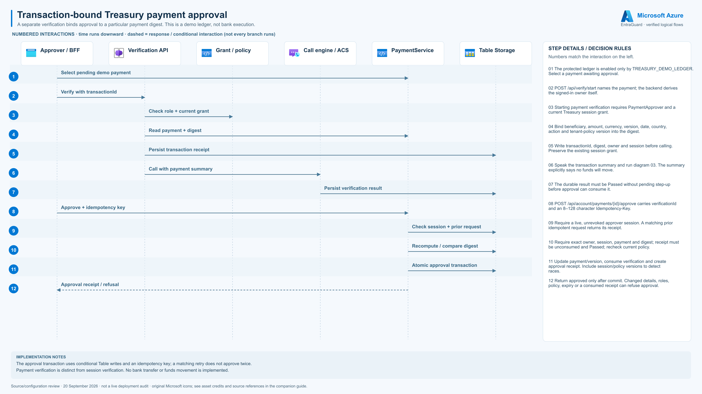

| Step | Interaction | Checks / outcomes |
|---|---|---|
| 1 | Select pending demo payment | The protected ledger is enabled only by TREASURY_DEMO_LEDGER. Select a payment awaiting approval. |
| 2 | Verify with transactionId | POST /api/verify/start names the payment; the backend derives the signed-in owner itself. |
| 3 | Check role + current grant | Starting payment verification requires PaymentApprover and a current Treasury session grant. |
| 4 | Read payment + digest | Bind beneficiary, amount, currency, version, date, country, action and tenant-policy version into the digest. |
| 5 | Persist transaction receipt | Write transactionId, digest, owner and session before calling. Preserve the existing session grant. |
| 6 | Call with payment summary | Speak the transaction summary and run diagram 03. The summary explicitly says no funds will move. |
| 7 | Persist verification result | The durable result must be Passed without pending step-up before approval can consume it. |
| 8 | Approve + idempotency key | POST /api/account/payments/{id}/approve carries verificationId and an 8–128 character Idempotency-Key. |
| 9 | Check session + prior request | Require a live, unrevoked approver session. A matching prior idempotent request returns its receipt. |
| 10 | Recompute / compare digest | Require exact owner, session, payment and digest; receipt must be unconsumed and Passed; recheck current policy. |
| 11 | Atomic approval transaction | Update payment/version, consume verification and create approval receipt. Include session/policy versions to detect races. |
| 12 | Approval receipt / refusal | Return approved only after commit. Changed details, roles, policy, expiry or a consumed receipt can refuse approval. |

- The approval transaction uses conditional Table writes and an idempotency key; a matching retry does not approve twice.
- Payment verification is distinct from session verification. No bank transfer or funds movement is implemented.

<details>
<summary>Editable Mermaid view</summary>

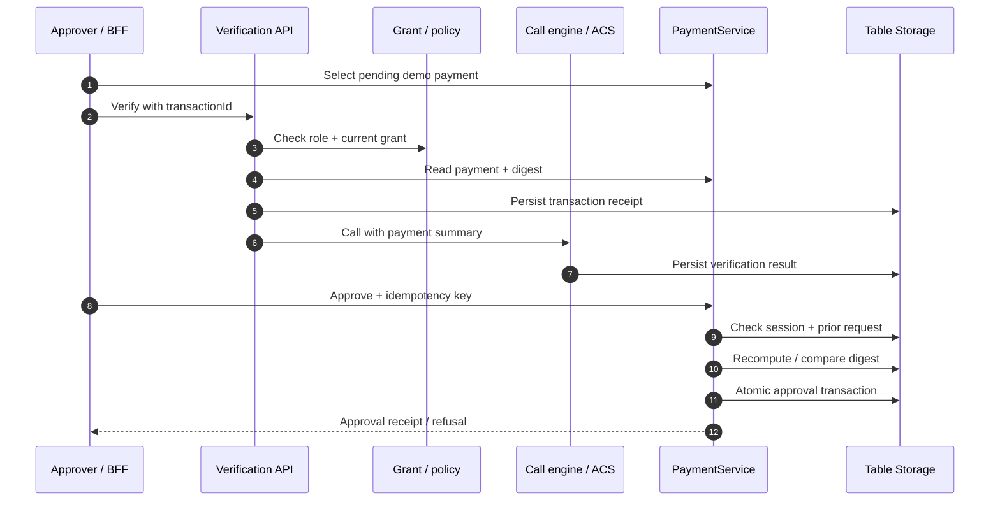

</details>

**Source evidence:**

- [`src/EntraGuard.MediaService/Sessions/PaymentService.cs`](../src/EntraGuard.MediaService/Sessions/PaymentService.cs)
- [`src/EntraGuard.MediaService/Endpoints/VerificationEndpoint.cs`](../src/EntraGuard.MediaService/Endpoints/VerificationEndpoint.cs)
- [`src/EntraGuard.MediaService/Endpoints/AccountEndpoints.cs`](../src/EntraGuard.MediaService/Endpoints/AccountEndpoints.cs)
- [`src/EntraGuard.MediaService/Persistence/VerificationLedger.cs`](../src/EntraGuard.MediaService/Persistence/VerificationLedger.cs)
- [`src/EntraGuard.MediaService/Sessions/TenantPolicyService.cs`](../src/EntraGuard.MediaService/Sessions/TenantPolicyService.cs)

## 06 — Incoming monitored-call analysis and response

Event Grid starts the incoming-call path. PolicyGate and Actuator govern remediation, not the language model.

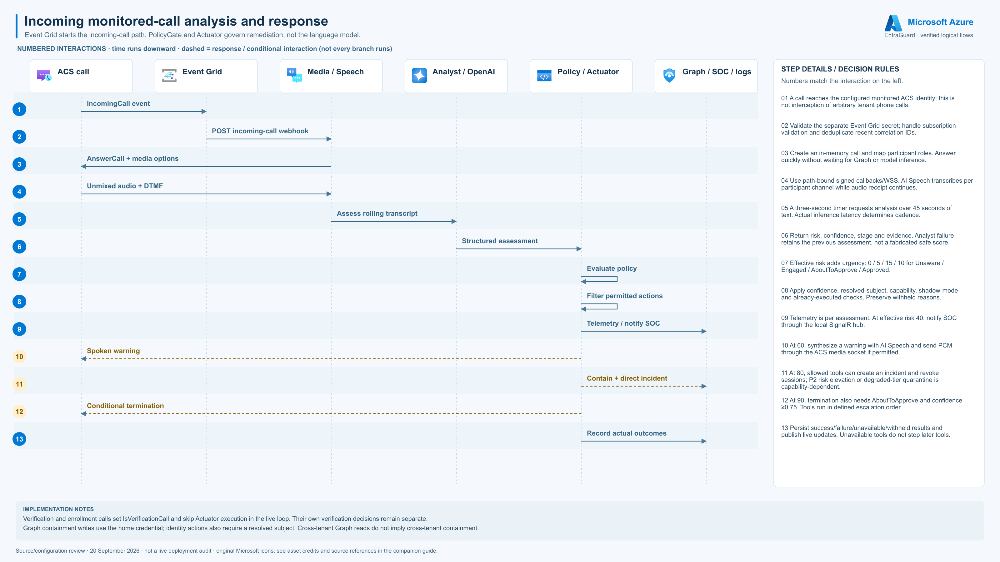

| Step | Interaction | Checks / outcomes |
|---|---|---|
| 1 | IncomingCall event | A call reaches the configured monitored ACS identity; this is not interception of arbitrary tenant phone calls. |
| 2 | POST incoming-call webhook | Validate the separate Event Grid secret; handle subscription validation and deduplicate recent correlation IDs. |
| 3 | AnswerCall + media options | Create an in-memory call and map participant roles. Answer quickly without waiting for Graph or model inference. |
| 4 | Unmixed audio + DTMF | Use path-bound signed callbacks/WSS. AI Speech transcribes per participant channel while audio receipt continues. |
| 5 | Assess rolling transcript | A three-second timer requests analysis over 45 seconds of text. Actual inference latency determines cadence. |
| 6 | Structured assessment | Return risk, confidence, stage and evidence. Analyst failure retains the previous assessment, not a fabricated safe score. |
| 7 | Evaluate policy | Effective risk adds urgency: 0 / 5 / 15 / 10 for Unaware / Engaged / AboutToApprove / Approved. |
| 8 | Filter permitted actions | Apply confidence, resolved-subject, capability, shadow-mode and already-executed checks. Preserve withheld reasons. |
| 9 | Telemetry / notify SOC | Telemetry is per assessment. At effective risk 40, notify SOC through the local SignalR hub. |
| 10 | Spoken warning *(conditional)* | At 60, synthesize a warning with AI Speech and send PCM through the ACS media socket if permitted. |
| 11 | Contain + direct incident *(conditional)* | At 80, allowed tools can create an incident and revoke sessions; P2 risk elevation or degraded-tier quarantine is capability-dependent. |
| 12 | Conditional termination *(conditional)* | At 90, termination also needs AboutToApprove and confidence ≥0.75. Tools run in defined escalation order. |
| 13 | Record actual outcomes | Persist success/failure/unavailable/withheld results and publish live updates. Unavailable tools do not stop later tools. |

- Verification and enrollment calls set IsVerificationCall and skip Actuator execution in the live loop. Their own verification decisions remain separate.
- Graph containment writes use the home credential; identity actions also require a resolved subject. Cross-tenant Graph reads do not imply cross-tenant containment.

<details>
<summary>Editable Mermaid view</summary>

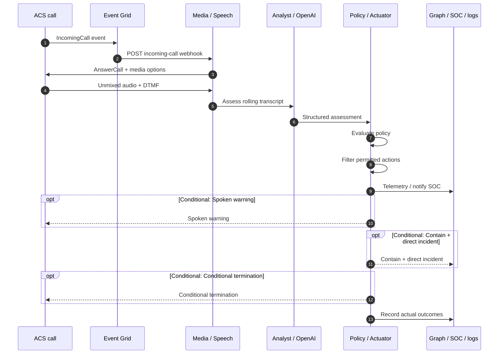

</details>

**Source evidence:**

- [`src/EntraGuard.MediaService/Endpoints/IncomingCallEndpoint.cs`](../src/EntraGuard.MediaService/Endpoints/IncomingCallEndpoint.cs)
- [`src/EntraGuard.MediaService/Endpoints/MediaSocketEndpoint.cs`](../src/EntraGuard.MediaService/Endpoints/MediaSocketEndpoint.cs)
- [`src/EntraGuard.Shared/Policy/PolicyGate.cs`](../src/EntraGuard.Shared/Policy/PolicyGate.cs)
- [`src/EntraGuard.MediaService/Agents/ActuatorAgent.cs`](../src/EntraGuard.MediaService/Agents/ActuatorAgent.cs)
- [`src/EntraGuard.MediaService/Tools/GraphIdentityTools.cs`](../src/EntraGuard.MediaService/Tools/GraphIdentityTools.cs)
- [`src/EntraGuard.MediaService/Tools/CallControlTools.cs`](../src/EntraGuard.MediaService/Tools/CallControlTools.cs)
- [`src/EntraGuard.MediaService/Tools/ObservabilityTools.cs`](../src/EntraGuard.MediaService/Tools/ObservabilityTools.cs)
- [`scripts/04-eventgrid-subscribe.sh`](../scripts/04-eventgrid-subscribe.sh)

## 07 — Voice enrollment, consent and template storage

The current enrollment endpoint calls Teams. The internal speaker model scores audio; it never authorizes access.

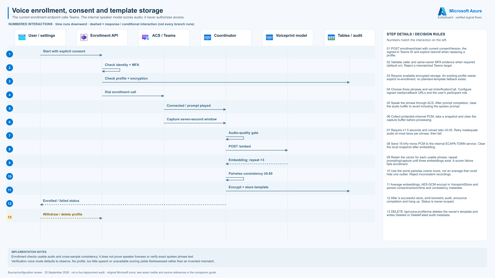

| Step | Interaction | Checks / outcomes |
|---|---|---|
| 1 | Start with explicit consent | POST enrollment/start with current consentVersion, the signed-in Teams ID and explicit reenroll when replacing a profile. |
| 2 | Check identity + MFA | Validate caller and same-owner MFA evidence when required (default on). Reject a mismatched Teams target. |
| 3 | Check profile + encryption | Require available encrypted storage. An existing profile needs explicit re-enrollment; no plaintext-template fallback exists. |
| 4 | Dial enrollment call | Choose three phrases and set IsVerificationCall. Configure signed media/callback URLs and the user's participant role. |
| 5 | Connected / prompt played | Speak the phrase through ACS. After prompt completion, clear the audio buffer to avoid including the spoken prompt. |
| 6 | Capture seven-second window | Collect protected-channel PCM, take a snapshot and clear the capture buffer before processing. |
| 7 | Audio-quality gate | Require ≥1.5 seconds and voiced ratio ≥0.05. Retry inadequate audio at most twice per phrase, then fail. |
| 8 | POST /embed | Send 16 kHz mono PCM to the internal ECAPA-TDNN service. Clear the local snapshot after embedding. |
| 9 | Embedding; repeat ×3 | Retain the vector for each usable phrase; repeat prompting/capture until three embeddings exist. A scorer failure fails enrollment. |
| 10 | Pairwise consistency ≥0.60 | Use the worst pairwise cosine score, not an average that could hide one outlier. Reject inconsistent recordings. |
| 11 | Encrypt + store template | Average embeddings; AES-GCM encrypt in VoiceprintStore and persist consent/version/time and consistency metadata. |
| 12 | Enrolled / failed status | After a successful store, emit biometric audit, announce completion and hang up. Status is owner-scoped. |
| 13 | Withdraw / delete profile *(conditional)* | DELETE /api/voice-profile/me deletes the owner's template and writes Deleted or DeleteFailed audit metadata. |

- Enrollment checks usable audio and cross-sample consistency; it does not prove speaker liveness or verify exact spoken phrase text.
- Verification voice mode defaults to observe. No profile, too little speech or unavailable scoring yields NotAssessed rather than an invented mismatch.

<details>
<summary>Editable Mermaid view</summary>

```mermaid
sequenceDiagram
    autonumber
    participant P0 as User / settings
    participant P1 as Enrollment API
    participant P2 as ACS / Teams
    participant P3 as Coordinator
    participant P4 as Voiceprint model
    participant P5 as Tables / audit
    P0->>P1: Start with explicit consent
    P1->>P1: Check identity + MFA
    P1->>P5: Check profile + encryption
    P1->>P2: Dial enrollment call
    P2->>P3: Connected / prompt played
    P2->>P3: Capture seven-second window
    P3->>P3: Audio-quality gate
    P3->>P4: POST /embed
    P4-->>P3: Embedding; repeat ×3
    P3->>P3: Pairwise consistency ≥0.60
    P3->>P5: Encrypt + store template
    P3-->>P0: Enrolled / failed status
    opt Conditional: Withdraw / delete profile
    P0-->>P1: Withdraw / delete profile
    end
```

</details>

**Source evidence:**

- [`src/EntraGuard.MediaService/Endpoints/VoiceEnrollmentEndpoint.cs`](../src/EntraGuard.MediaService/Endpoints/VoiceEnrollmentEndpoint.cs)
- [`src/EntraGuard.MediaService/Sessions/VoiceEnrollmentCoordinator.cs`](../src/EntraGuard.MediaService/Sessions/VoiceEnrollmentCoordinator.cs)
- [`src/EntraGuard.MediaService/Agents/VoiceprintClient.cs`](../src/EntraGuard.MediaService/Agents/VoiceprintClient.cs)
- [`src/EntraGuard.MediaService/Sinks/VoiceprintStore.cs`](../src/EntraGuard.MediaService/Sinks/VoiceprintStore.cs)
- [`src/voiceprint/app.py`](../src/voiceprint/app.py)
- [`src/EntraGuard.MediaService/Auth/MfaEvidence.cs`](../src/EntraGuard.MediaService/Auth/MfaEvidence.cs)

## 08 — Durable evidence, telemetry and recovery

Treasury commits state before grant; telemetry is delivered by an outbox. Live sockets remain process-local.

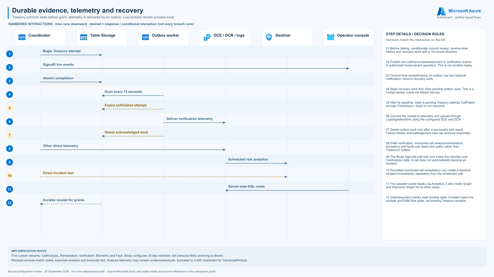

| Step | Interaction | Checks / outcomes |
|---|---|---|
| 1 | Begin Treasury attempt | Before dialing, conditionally commit receipt, reverse-time history and recovery work with a 15-minute deadline. |
| 2 | SignalR live events | Publish live call/transcript/assessment or verification events to authorized home-tenant operators. This is not durable replay. |
| 3 | Atomic completion | Commit final receipt/history, an outbox row and optional notification; remove recovery work. |
| 4 | Scan every 15 seconds | Read recovery work first, then pending outbox work. This is a hosted worker inside the Media Service. |
| 5 | Expire unfinished attempt *(conditional)* | After its deadline, mark a pending Treasury attempt CallFailed through FinishAsync. Audio is not resumed. |
| 6 | Deliver verification telemetry | Convert the receipt to telemetry and upload through LogsIngestionSink using the configured DCE and DCR. |
| 7 | Delete acknowledged work *(conditional)* | Delete outbox work only after a successful sink result. Failure retries; acknowledgement loss can produce duplicates. |
| 8 | Other direct telemetry | EAM verification, monitored-call analysis/remediation, biometrics and faults use direct sink paths rather than Treasury's outbox. |
| 9 | Scheduled risk analytics | The Bicep high-risk-call rule runs every five minutes over CallAnalysis data. A call does not automatically become an incident. |
| 10 | Direct incident tool *(conditional)* | Permitted monitored-call remediation can create a Sentinel incident immediately, separately from the scheduled rule. |
| 11 | Server-side KQL reads | The operator portal reads Log Analytics; it also reads Graph and Resource Graph for its other views. |
| 12 | Durable receipt for grants | Grant/payment checks read durable state. A restart loses live sockets and EAM flow state, not existing Treasury receipts. |

- Five custom streams: CallAnalysis, Remediation, Verification, Biometric and Fault. Bicep configures 30-day retention; full transcript Blob archiving is absent.
- Receipts exclude match codes, expected answers and transcript text. Analysis telemetry may contain evidence/excerpts, truncated to 4,000 characters for TranscriptWindow.

<details>
<summary>Editable Mermaid view</summary>

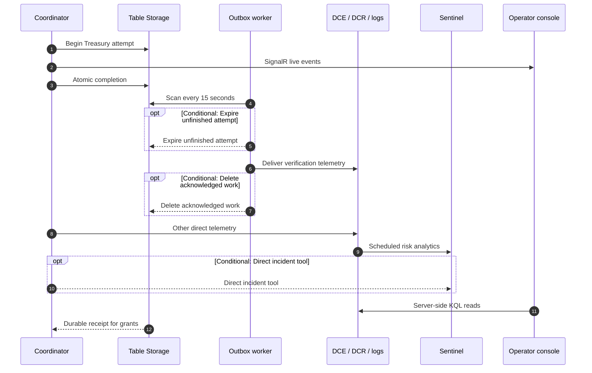

</details>

**Source evidence:**

- [`src/EntraGuard.MediaService/Persistence/VerificationLedger.cs`](../src/EntraGuard.MediaService/Persistence/VerificationLedger.cs)
- [`src/EntraGuard.MediaService/Persistence/VerificationOutboxWorker.cs`](../src/EntraGuard.MediaService/Persistence/VerificationOutboxWorker.cs)
- [`src/EntraGuard.MediaService/Sinks/LogsIngestionSink.cs`](../src/EntraGuard.MediaService/Sinks/LogsIngestionSink.cs)
- [`src/EntraGuard.MediaService/Sessions/VerificationCoordinator.cs`](../src/EntraGuard.MediaService/Sessions/VerificationCoordinator.cs)
- [`src/EntraGuard.MediaService/Tools/ObservabilityTools.cs`](../src/EntraGuard.MediaService/Tools/ObservabilityTools.cs)
- [`infra/modules/observability.bicep`](../infra/modules/observability.bicep)
- [`src/portal/lib/azure/logs.ts`](../src/portal/lib/azure/logs.ts)

## Authoring and assets

- Sequence content: `docs/diagrams/flows/flow-definitions.json`.
- Logical/decision layouts and renderer: `scripts/render-architecture-flows.cjs`.
- Rebuild: `node scripts/render-architecture-flows.cjs` (uses existing `src/portal` sharp dependency; no network needed).
- [Official Microsoft icon sources and usage credits](diagrams/azure-icons/README.md). Browser/Code symbols represent generic web/API/custom code, not additional Azure managed services.
- Generated SVGs embed the original SVG icon bytes; PNG/SVG files do not require external asset downloads.
