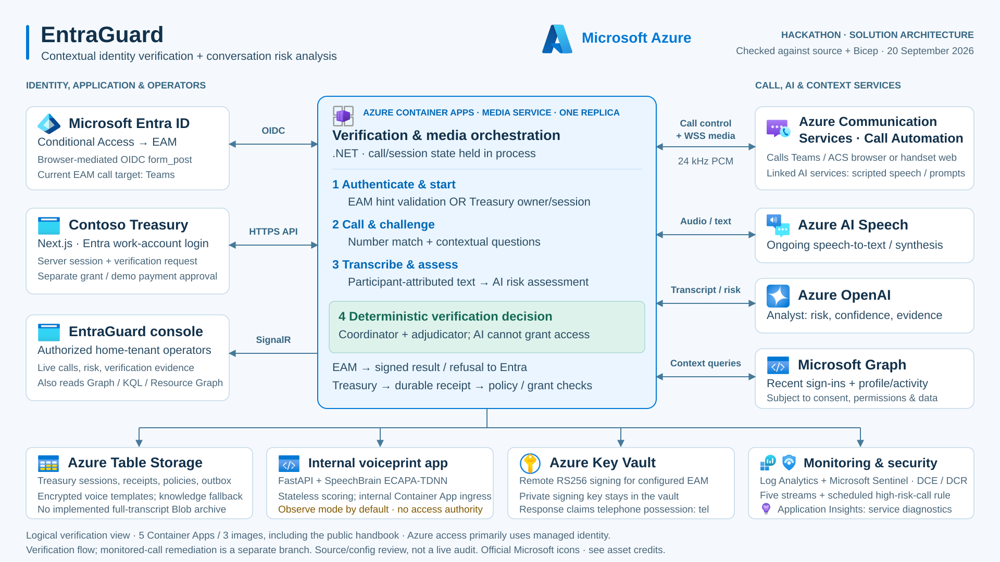

# EntraGuard — verified solution architecture

Reviewed against the local implementation, Bicep and deployment scripts on **20 September 2026**. This is a source/configuration verification, not confirmation of current Azure resource health, deployed model version, tenant consent or enabled runtime settings.

## Video-ready diagram

For detailed numbered interactions, decisions and source evidence, see the [nine-diagram logical and step-by-step flow pack](architecture-flows.md).



- **SVG:** [1920 × 1080, editable vector](diagrams/hackathon-architecture.svg).
- **PNG:** [1920 × 1080, for video editors and slides](diagrams/hackathon-architecture.png).
- **4K PNG:** [3840 × 2160, for high-resolution slides and video zooms](diagrams/hackathon-architecture-4k.png).
- **Assets:** Official Azure and Microsoft Entra architecture icons, with the Azure platform logo. See [original asset sources and credits](diagrams/azure-icons/README.md).
- **Editable source:** [SVG with local icon references](diagrams/hackathon-architecture.source.svg). Run `node scripts/render-hackathon-architecture.cjs` to regenerate the self-contained SVG and both PNGs.
- The slide shows the main verification flow. The diagrams below expand the runtime boundaries and the separate incoming-call remediation branch.
- Arrows represent logical interactions; OIDC travels through the user's browser, not a direct Entra-to-service back channel. The bottom shared connector groups Media Service dependencies, not a messaging bus.

Suggested narration, approximately 15 seconds:

> “EntraGuard connects Entra ID to a live verification call. Azure Communication Services carries the audio, Speech transcribes it, and Azure OpenAI assesses conversation risk. Deterministic verification code controls the outcome, with operator visibility through SignalR and Azure monitoring.”

## 1. Solution and deployment boundaries

```mermaid
flowchart TB
    person["User / work account"]
    entra["Microsoft Entra ID<br/>Sign-in + Conditional Access"]
    endpoints["Call endpoints<br/>Teams / ACS browser / handset web page"]
    acs["Azure Communication Services<br/>Call Automation + media streaming"]
    cognitive["Azure AI services — multi-service resource<br/>ACS scripted speech / recognition"]
    speech["Azure AI Speech<br/>Continuous STT / speech synthesis"]
    aoai["Azure OpenAI<br/>Configured Analyst deployment"]
    graph["Microsoft Graph<br/>Sign-in and profile/activity queries"]

    subgraph aca["Azure Container Apps environment — 5 apps, 3 images"]
        treasury["Contoso Treasury<br/>Next.js · APP_MODE=treasury"]
        operator["Operator console<br/>Next.js · home-tenant operators"]
        handbook["Public handbook<br/>Next.js · APP_MODE=docs"]
        media["EntraGuard.MediaService<br/>.NET · one replica<br/>HTTP, callbacks, WSS, SignalR<br/>Coordinators + agents + decision code"]
        voice["Voiceprint service<br/>FastAPI + SpeechBrain ECAPA-TDNN<br/>Internal ingress · stateless scoring"]
    end

    person --> entra
    person --> treasury
    entra <-->|"EAM form_post via browser; configured path"| media
    treasury <-->|"Owner/session APIs + separate grant checks"| media
    media -->|"SignalR live events"| operator
    media <-->|"Create/answer calls, callbacks, duplex WSS"| acs
    acs <--> endpoints
    acs -->|"Linked cognitive endpoint"| cognitive
    media <-->|"Audio / transcription / synthesis"| speech
    media <-->|"Transcript / structured risk assessment"| aoai
    media <-->|"Context queries; consent-dependent"| graph
    media <-->|"PCM / embedding / score"| voice

    tables["Azure Table Storage<br/>EntraGuardState<br/>EntraGuardVoiceprints<br/>EntraGuardKnowledge fallback"]
    vault["Azure Key Vault<br/>EAM remote RS256 signing"]
    ingestion["Logs Ingestion API<br/>DCE + DCR"]
    logs["Log Analytics<br/>5 custom EntraGuard tables"]
    sentinel["Microsoft Sentinel<br/>Scheduled high-risk-call analytics"]
    insights["Application Insights<br/>Media Service diagnostics"]
    resourcegraph["Azure Resource Graph<br/>Resource footprint reads"]
    registry["Azure Container Registry<br/>Media / portal / voiceprint images"]

    media <--> tables
    media <-->|"Sign digest; public key discovery"| vault
    media --> ingestion --> logs --> sentinel
    media --> insights
    operator -->|"Server-side KQL"| logs
    operator -->|"Server-side directory reads"| graph
    operator --> resourcegraph
    registry -.->|"Image pulls"| aca
```

**Identity:** Azure service access primarily uses the user-assigned managed identity and `DefaultAzureCredential`. Cross-tenant **Graph reads** can exchange the managed-identity assertion through the configured multitenant application, with customer-tenant consent. Graph remediation writes currently use the home credential; do not infer cross-tenant containment from the cross-tenant read path.

**Deployment:** Treasury, operator console and handbook share the portal image. The agents are classes running inside the Media Service, not separate agent containers. The voiceprint app is a separate Container App, despite some files calling it a “sidecar.” Bicep provisions resources; scripts also configure app registrations, Event Grid subscriptions, EAM signing certificates and runtime settings.

## 2. Verification and authorization — two entry paths

```mermaid
flowchart TD
    ca["Entra Conditional Access requests an external factor"]
    eam["EAM endpoint validates signed hint + redirect + requested factor<br/>Requires signing configuration"]
    rp["Treasury request with validated owner and revocable server session"]
    preflight["Check device ownership, tenant channel policy,<br/>optional transaction binding; persist starting receipt"]
    launcher["Shared VerificationLauncher + VerificationCoordinator"]
    call["ACS verification call<br/>Number match + selected contextual questions"]
    context["Graph sign-in/profile sources + optional registered knowledge<br/>Questions selected from available evidence"]
    perception["Participant-channel PCM → PerceptionAgent / AI Speech<br/>Attributed transcript"]
    analyst["AnalystAgent → Azure OpenAI<br/>Risk + confidence + evidence"]
    adjudicator["Deterministic coordinator + VerificationAdjudicator<br/>Answer rules, coercion checks, optional enforced voice step-up"]
    voice["Internal voiceprint scoring<br/>Observe mode by default"]
    result["Verification result + source-aware assurance"]
    receipt["Treasury: durable receipt / history / outbox"]
    grant["GrantService + TenantPolicyService<br/>Owner, session, freshness, assurance, channel, policy checks"]
    payment["PaymentService<br/>Transaction-bound demo approval checks"]
    eamresult["EAM: registry result → EamTokenIssuer<br/>Key Vault RS256; amr = tel, or refusal"]

    ca --> eam -->|"Teams target in current code"| launcher
    rp --> preflight -->|"Teams or registered ACS web endpoint"| launcher
    launcher --> call
    context --> call
    call --> perception --> analyst --> adjudicator
    call -->|"Number entry and answers"| adjudicator
    voice -.->|"No refusal while observing"| adjudicator
    adjudicator --> result
    result --> receipt --> grant
    receipt --> payment
    result --> eamresult
    eamresult -->|"Browser form_post"| ca
```

Important boundaries verified in code:

- **EAM currently calls Teams.** Treasury can choose Teams or a registered ACS browser/handset-web endpoint. A handset web page is not a PSTN phone call.
- **EAM is opt-in configuration.** Discovery/JWKS and authorization are unavailable without signing configuration. Requested factors the telephone-possession method cannot satisfy are declined before calling.
- **EAM and Treasury do not share the same authorization lifecycle.** EAM reads its in-memory flow/verification registry and issues an OIDC result. The Treasury path uses durable, session-bound receipts and separate grant/payment checks. EAM completion writes verification telemetry directly rather than a Treasury receipt/outbox.
- **AI assessment is not an authorization decision.** The coordinator applies question rules, and `VerificationAdjudicator` refuses coercion at raw risk **≥60** with confidence **≥0.75**, including when the code is correct. `PolicyGate` has a separate role in monitored-call remediation.
- **Source-aware assurance is not a certified assurance level.** The implementation computes `None/Low/Substantial/High`; Treasury policy can enforce the result. It is not an AAL/eIDAS certification or an EAM biometric claim.
- **Voice is observe-mode by default.** Explicit enforcement can require additional MFA; the voiceprint service itself cannot authorize. EAM currently claims `amr: ["tel"]`, never `vbm`.

## 3. Incoming monitored-call remediation — separate branch

```mermaid
flowchart LR
    incoming["Call to monitored ACS identity"]
    eg["Event Grid<br/>IncomingCall event"]
    answer["IncomingCallEndpoint<br/>AnswerCall + media setup"]
    stream["ACS WSS media<br/>PerceptionAgent + AI Speech"]
    analyst["AnalystAgent<br/>Azure OpenAI assessment"]
    gate["PolicyGate<br/>Urgency, confidence, subject,<br/>tenant capability, shadow mode"]
    actuator["ActuatorAgent<br/>Execute permitted tools"]
    graph["Home-credential Graph writes<br/>Revoke sessions; risk elevation OR quarantine"]
    control["ACS call control<br/>Warning / conditional termination"]
    soc["SignalR SOC alert"]
    sentinel["Direct Sentinel incident<br/>plus telemetry to Log Analytics"]

    incoming --> eg --> answer --> stream --> analyst --> gate --> actuator
    actuator --> graph
    actuator --> control
    actuator --> soc
    actuator --> sentinel
```

- This covers calls delivered to the configured monitored ACS identity, not arbitrary phone calls throughout an organization.
- In the shared live analysis loop, `IsVerificationCall` **skips Actuator execution**. An outbound verification can be refused by its adjudicator, but that is not automatic session revocation or quarantine. The optional realtime voice agent may switch to a protective register.
- Remediation uses **effective risk**, including urgency weighting: notify **40**, warn **60**, contain **80**, terminate **90**. Disruptive actions also require confidence **≥0.75**; termination requires `AboutToApprove`. Identity actions require an identified subject and permissions.
- P2-capable risk elevation and degraded-tier quarantine are capability-dependent alternatives. Shadow mode suppresses call/identity remediation but can still notify the SOC and create incidents.
- The Event Grid subscription is wired by `scripts/04-eventgrid-subscribe.sh`; it is not the route by which outbound verification starts.

## 4. Solution components and what each solves

| Component | Responsibility in this implementation |
|---|---|
| Microsoft Entra ID + EAM | Work-account identity and policy-driven external-factor integration; configured separately from Treasury grants. |
| Azure Container Apps | Runs the Media Service HTTP/WebSocket server, three portal modes and internal speaker scorer. |
| Azure Communication Services | Places/answers calls, receives callbacks, carries unmixed bidirectional PCM and DTMF. |
| Azure AI services multi-service resource | Linked cognitive endpoint used by ACS for scripted speech/recognition. |
| Azure AI Speech | Continuously transcribes participant audio; also supports speech synthesis. |
| Azure OpenAI | Produces structured conversation-risk assessments; also used by the knowledge-answer judge. The deployed model is configurable; `gpt-5-mini` is the Bicep default, not a live-model verification. |
| Microsoft Graph | Supplies recent sign-ins and permitted directory/calendar/mail/chat/file context; remediation tools use separate write operations. |
| Deterministic decision code | Separates AI scoring from verification outcomes, grant authorization and remediation authority. |
| Azure Table Storage | Durable Treasury state, receipts, policy, history and telemetry outbox; encrypted voice templates and registered-knowledge fallback. |
| Key Vault | Holds EAM signing key material and remotely signs response tokens. It does not imply every application secret is stored there. |
| SignalR | Media Service-hosted hub for live operator events; no separate Azure SignalR Service is declared. |
| Log Analytics + Sentinel | Five custom telemetry streams; scheduled high-risk-call analytics; direct incidents on the monitored-call remediation path. |
| Application Insights | Media Service request/exception diagnostics when configured. |
| Azure Container Registry + Bicep/scripts | Container image distribution and reproducible resource/configuration setup. |

## 5. Evidence checklist

Paths below are relative to the repository root; each supports the stated diagram element.

| Verified element | Source evidence |
|---|---|
| Five Container Apps, shared portal image, internal voiceprint ingress, media min/max replicas = 1 | `infra/modules/compute.bicep`: `mediaService`, `portal`, `treasury`, `docs`, `voiceprint`. |
| Managed identity and Azure client wiring; local SignalR hub; optional Application Insights | `src/EntraGuard.MediaService/Program.cs`. |
| EAM configuration, hint validation, Teams target, registry-based outcome | `src/EntraGuard.MediaService/Endpoints/ExternalAuthMethodEndpoint.cs`: `MapExternalAuthMethod`. |
| EAM signing and actual factor claim | `src/EntraGuard.MediaService/Auth/EamSigningKeys.cs`: `SignAsync`; `Auth/EamTokenIssuer.cs`; `src/EntraGuard.Shared/Verification/EamClaims.cs`: `CallAmr`. |
| Treasury verification proxy and grant enforcement | `src/portal/app/api/verify/route.ts`; `src/portal/lib/rpProxy.ts`; `src/EntraGuard.MediaService/Endpoints/VerificationEndpoint.cs`; `Sessions/GrantService.cs`; `Sessions/PaymentService.cs`. |
| Unmixed, duplex 24 kHz PCM + DTMF; ACS cognitive endpoint | `src/EntraGuard.MediaService/Sessions/VerificationLauncher.cs`: `DialAsync`. |
| Speech recognition per participant, not physical-speaker diarization | `src/EntraGuard.MediaService/Agents/PerceptionAgent.cs`: `GetOrCreateRecognizer`. |
| AI assessment and configurable model | `src/EntraGuard.MediaService/Agents/AnalystAgent.cs`; `Agents/AnalystClient.cs`; `infra/modules/ai.bicep`; `infra/main.bicep`. |
| Contextual question sources and cross-tenant reads | `src/EntraGuard.MediaService/Agents/TelemetryChallenge.cs`; `Agents/ProfileChallenge.cs`; `Tools/CrossTenantGraph.cs`. |
| Coercion refusal and separate remediation policy | `src/EntraGuard.MediaService/Endpoints/VerificationAdjudicator.cs`; `src/EntraGuard.Shared/Policy/PolicyGate.cs`. |
| Actuator skipped during verification calls | `src/EntraGuard.MediaService/Endpoints/MediaSocketEndpoint.cs`: `RunAnalysisLoopAsync`, `IsVerificationCall` branch. |
| Treasury-only durable completion path versus EAM telemetry | `src/EntraGuard.MediaService/Sessions/VerificationCoordinator.cs`: `CompleteAsync`, `RpSessionId` branch. |
| Durable table state and outbox | `src/EntraGuard.MediaService/Persistence/TableStateStore.cs`; `Persistence/VerificationLedger.cs`; `Persistence/VerificationOutboxWorker.cs`. |
| Encrypted voice templates and knowledge fallback | `src/EntraGuard.MediaService/Sinks/VoiceprintStore.cs`; `Sinks/KnowledgeStore.cs`. |
| Stateless speaker service and observe-mode default | `src/voiceprint/app.py`; `src/EntraGuard.MediaService/Program.cs`: `VoiceEnforce`; `scripts/deploy-apps.sh`: `VOICE_MODE`. |
| Incoming-call event route | `src/EntraGuard.MediaService/Endpoints/IncomingCallEndpoint.cs`; `infra/modules/communication.bicep`; `scripts/04-eventgrid-subscribe.sh`. |
| Remediation destinations and home-credential writes | `src/EntraGuard.MediaService/Tools/GraphIdentityTools.cs`; `Tools/CallControlTools.cs`; `Tools/ObservabilityTools.cs`. |
| Five ingestion streams, Sentinel rule, 30-day configured retention | `src/EntraGuard.MediaService/Sinks/LogsIngestionSink.cs`; `Configuration/EntraGuardOptions.cs`; `infra/modules/observability.bicep`. |
| Operator live events and server-side reads | `src/portal/components/az/LiveConsole.tsx`; `src/portal/app/(admin)/live/page.tsx`; `src/portal/lib/azure/logs.ts`, `graph.ts`, `resourceGraph.ts`. |

## 6. Accuracy notes for the submission

1. **Unmixed audio is participant attribution, not room surveillance or speaker counting.** Two people sharing one microphone remain on one channel. The Analyst evaluates coaching language in the transcript; no physical-speaker diarization is implemented in the inspected perception path.
2. **Three seconds is the configured analysis interval, not a guaranteed verdict latency.** The loop awaits model inference; the rolling transcript window is 45 seconds.
3. **Do not claim “nothing is stored.”** Receipts, metadata, encrypted voice templates and transcript excerpts in telemetry are stored. Registered knowledge can include a readable answer in custom security attributes or the fallback table. Full-transcript Blob archiving is not implemented even though the container is provisioned.
4. **Realtime generative voice is optional.** `VOICE_AGENT=on` enables a separately configured realtime endpoint; scripted ACS speech is the default. The main slide does not imply this optional connection is enabled.
5. **No PSTN number is provisioned by the inspected infrastructure.** The implemented demo endpoints are Teams and ACS-powered browser/handset web experiences.
6. **The media engine is single-replica.** Durable Treasury records survive restart; live sockets, in-flight EAM flows and call coordinators do not resume across restart.
7. **Treasury is a demo application.** Payment approvals do not execute bank transfers.

These diagrams refine the older blog figure: media streaming connects **ACS to the Media Service**, operator KQL queries go **to Log Analytics**, and EAM signing, durable state and distinct authorization/remediation paths are explicitly represented here.
